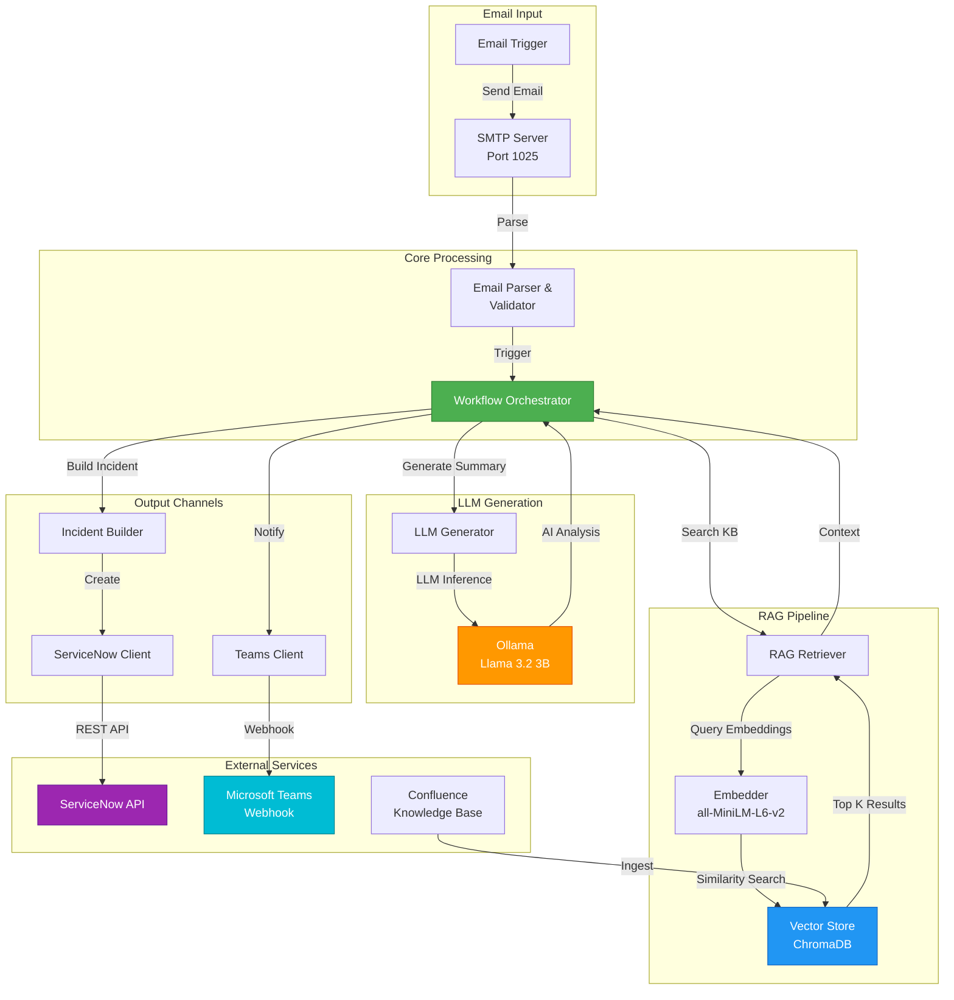
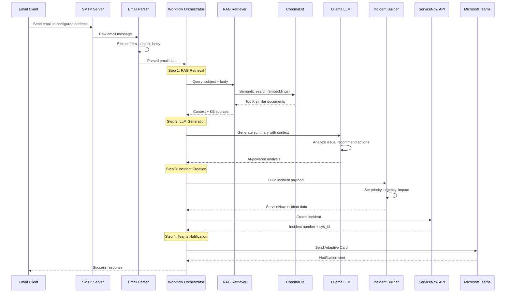
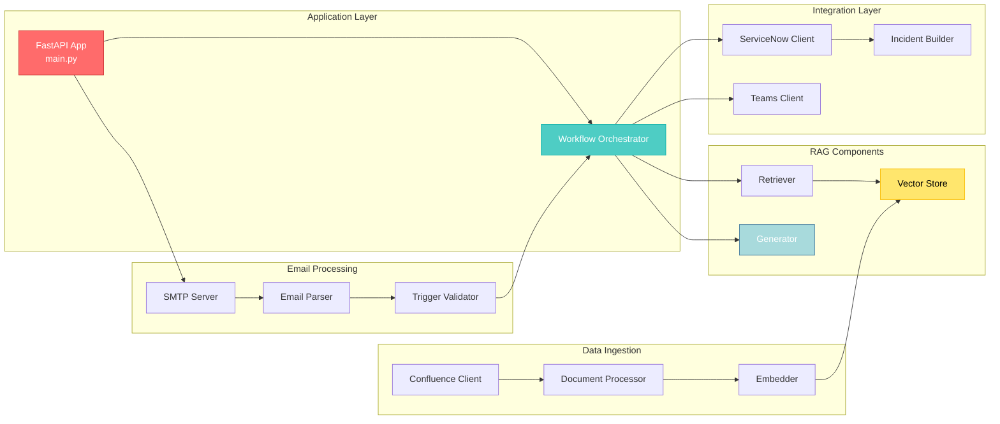
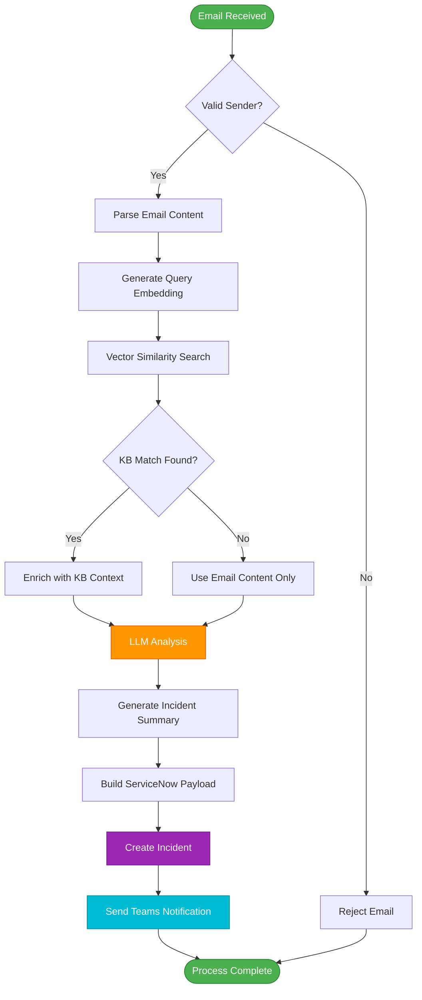

# RAG Incident Management System

**Automated incident creation using RAG (Retrieval-Augmented Generation), email triggers, ServiceNow integration, and Microsoft Teams notifications.**

[](https://www.python.org/downloads/)
[]()
[](https://docs.docker.com/compose/)
[]()

## 🎯 Overview

This system automatically creates ServiceNow incidents from incoming emails by leveraging RAG (Retrieval-Augmented Generation) to provide intelligent context and recommendations. The system searches a knowledge base, generates AI-powered incident summaries, and sends rich notifications to Microsoft Teams channels.

### Key Features

- 📧 **Email Trigger** - SMTP server receives and validates emails from authorized senders
- 🔍 **RAG Search** - Vector similarity search across Confluence knowledge base
- 🤖 **LLM Analysis** - Uses Ollama (Llama 3.2 3B) for intelligent incident summarization
- 🎫 **Auto-Ticketing** - Creates ServiceNow incidents with AI-generated insights
- 💬 **Teams Integration** - Rich Adaptive Card notifications in Microsoft Teams
- 📊 **Monitoring** - Comprehensive health checks and metrics endpoints
- 🧪 **Mock Services** - Built-in mocks for testing without external dependencies
- 📈 **Observability** - Structured logging with Loguru

## 🏗️ Architecture

### High-Level System Architecture



### Detailed Workflow Sequence



### Component Architecture



### Data Flow



## ✨ Features

### RAG (Retrieval-Augmented Generation)
- **Vector Search**: Semantic search using sentence transformers embeddings
- **Top-K Retrieval**: Configurable number of most relevant knowledge base articles
- **Similarity Threshold**: Only use articles above confidence threshold (default: 0.7)
- **Context Enrichment**: Augment LLM prompts with relevant documentation

### LLM-Powered Analysis
- **Incident Summarization**: Automatically generate clear, concise incident descriptions
- **Root Cause Analysis**: Identify potential causes based on similar historical issues
- **Recommended Actions**: Suggest specific troubleshooting steps
- **Priority Classification**: Intelligent urgency and impact assessment
- **KB References**: Extract relevant knowledge base article names

### Microsoft Teams Integration
- **Adaptive Cards**: Rich, formatted notifications with structured information
- **Priority-Based Coloring**: Visual indication of incident severity (P1-P5)
- **Incident Details**: Number, priority, urgency, impact, category, caller
- **AI Insights**: LLM-generated analysis and recommended actions
- **KB Links**: Direct links to relevant knowledge base articles with similarity scores
- **Health Monitoring**: Teams webhook status in health endpoint

### ServiceNow Integration
- **Automatic Incident Creation**: REST API integration with ServiceNow
- **Smart Field Mapping**: LLM output mapped to ServiceNow incident fields
- **Priority Calculation**: Automatic priority based on urgency × impact matrix
- **Work Notes**: Append AI analysis and KB references as work notes
- **Fallback Handling**: Create basic incidents even if LLM fails

### Email Processing
- **SMTP Server**: Built-in SMTP server for receiving emails
- **Sender Validation**: Configurable whitelist of allowed email senders
- **HTML/Plain Text**: Parse both HTML and plain text email bodies
- **Multipart Support**: Handle complex multipart email structures
- **Header Extraction**: Parse from, to, subject, date headers

## 🚀 Quick Start

### Prerequisites

- **Docker** & **Docker Compose** (v2.0+)
- **Python** 3.11+ (for local development)
- **~10GB disk space** (for Ollama model and vector database)
- **4GB RAM minimum** (8GB recommended)

### Option 1: Docker Compose (Recommended)

```bash
# 1. Clone repository
git clone https://github.com/ihabbishara/RAGIncidentApp.git
cd RAGIncidentApp

# 2. Copy environment configuration
cp .env.example .env
# Edit .env if needed (default values work for local testing)

# 3. Start all services
docker-compose up -d

# 4. Pull Ollama model (first time only, ~7 minutes)
docker exec rag-ollama ollama pull llama3.2:3b

# 5. Create test knowledge base data
docker exec rag-incident-app python scripts/create_test_data.py

# 6. Verify system health
curl http://localhost:8000/health | python3 -m json.tool
```

**Expected Output**:
```json
{
    "overall": "healthy",
    "components": {
        "llm": "healthy",
        "servicenow": "healthy",
        "vector_store": {
            "status": "healthy",
            "document_count": 16
        },
        "teams": "disabled"
    }
}
```

### Option 2: Local Development

```bash
# 1. Create virtual environment
python3.11 -m venv .venv
source .venv/bin/activate  # On Windows: .venv\Scripts\activate

# 2. Install dependencies
pip install -r requirements.txt

# 3. Copy and edit environment configuration
cp .env.example .env
# Edit .env: Change service hostnames from container names to localhost

# 4. Start external services only
docker-compose up -d ollama confluence-mock servicenow-mock maildev

# 5. Download Ollama model
docker exec rag-ollama ollama pull llama3.2:3b

# 6. Run application locally
python src/main.py

# 7. In another terminal, create test data
source .venv/bin/activate
python scripts/create_test_data.py
```

## 📝 Usage

### Test the System

#### 1. Using the Test Script
```bash
# Send a test email through SMTP
python scripts/test_email.py
```

#### 2. Using the API Endpoint
```bash
# Test without SMTP (faster for testing)
curl -X POST http://localhost:8000/api/test-email \
  -H "Content-Type: application/json" \
  -d '{
    "from": "xyz@test.com",
    "subject": "Database connection timeout issues",
    "body": "We are experiencing database connection timeouts in production. Multiple users reporting HTTP 504 errors. The application logs show connection pool exhaustion. Need urgent assistance to resolve this issue."
  }'
```

#### 3. Expected Response
```json
{
  "success": true,
  "incident_number": "INC0000001",
  "incident_sys_id": "uuid-here",
  "has_kb_match": true,
  "kb_sources_count": 3,
  "kb_sources": [
    {
      "title": "Database Connection Troubleshooting",
      "url": "https://confluence.example.com/...",
      "score": 0.85
    }
  ],
  "llm_summary": {
    "short_description": "Database Connection Timeout Issues",
    "description": "Multiple users reporting HTTP 504 errors...",
    "category": "Database Connectivity Issues",
    "urgency": 3,
    "impact": 5,
    "recommended_actions": [
      "Increase connection pool size",
      "Add connection retry logic",
      "Monitor database performance"
    ],
    "kb_references": [
      "Database Connection Troubleshooting",
      "HTTP 504 Gateway Timeout Guide"
    ]
  }
}
```

### View Created Incidents

```bash
# View all incidents
curl http://localhost:8002/api/now/table/incident | python3 -m json.tool

# View specific incident
curl http://localhost:8002/api/now/table/incident/{sys_id} | python3 -m json.tool
```

### Monitor Emails (MailDev UI)

Open http://localhost:1080 in your browser to see captured emails.

### API Endpoints

| Endpoint | Method | Description |
|----------|--------|-------------|
| `/` | GET | Root endpoint with service info |
| `/health` | GET | Health check for all components |
| `/stats` | GET | System statistics (document count, etc.) |
| `/api/test-email` | POST | Test email processing without SMTP |

## 🔧 Configuration

### Environment Variables

See [.env.example](.env.example) for complete configuration. Key settings:

#### Application Settings
```bash
ENVIRONMENT=development          # development | production
LOG_LEVEL=INFO                  # DEBUG | INFO | WARNING | ERROR
APP_HOST=0.0.0.0
APP_PORT=8000
```

#### LLM Configuration
```bash
LLM_PROVIDER=ollama
LLM_MODEL=llama3.2:3b          # Recommended: fast and accurate
LLM_BASE_URL=http://ollama:11434
LLM_TEMPERATURE=0.3             # Lower = more deterministic
LLM_MAX_TOKENS=512
LLM_TIMEOUT=120                 # Seconds
```

#### RAG Configuration
```bash
RAG_CHUNK_SIZE=800              # Characters per chunk
RAG_CHUNK_OVERLAP=200           # Overlap between chunks
RAG_TOP_K_RESULTS=5             # Number of results to retrieve
RAG_SIMILARITY_THRESHOLD=0.7    # Minimum similarity score
RAG_MAX_CONTEXT_LENGTH=2000     # Max context for LLM
```

#### Vector Database
```bash
VECTORDB_TYPE=chromadb
VECTORDB_PATH=/data/chromadb
VECTORDB_COLLECTION_NAME=confluence_docs
VECTORDB_PERSIST=true
```

#### Embedding Model
```bash
EMBEDDING_MODEL=sentence-transformers/all-MiniLM-L6-v2
EMBEDDING_DEVICE=cpu            # cpu | cuda | mps
EMBEDDING_BATCH_SIZE=32
```

#### Microsoft Teams
```bash
TEAMS_WEBHOOK_URL=https://your-webhook-url-here
TEAMS_ENABLED=true              # Enable/disable Teams notifications
```

See [docs/TEAMS_INTEGRATION.md](docs/TEAMS_INTEGRATION.md) for Teams setup instructions.

## 🧪 Testing

### Run All Tests

```bash
# Using Docker
docker exec rag-incident-app pytest -v

# Using local environment
pytest -v

# With coverage report
pytest --cov=src --cov-report=html --cov-report=term

# Specific test categories
pytest tests/unit/ -v           # Unit tests only (fast)
pytest tests/integration/ -v    # Integration tests
pytest tests/e2e/ -v            # End-to-end tests
```

### Test Coverage

Current coverage: **33/33 tests passing** ✅

```
tests/unit/               - 27 tests  (Email, Embedder, Builder, Processor)
tests/integration/        - 3 tests   (Workflow, Health, Fallback)
tests/e2e/               - 6 tests   (API endpoints)
```

### Run Quality Checks

```bash
# Format code
black src/ tests/

# Lint
ruff check src/ tests/

# Type checking
mypy src/
```

## 📂 Project Structure

```
RAGIncidentApp/
├── src/
│   ├── config/              # Configuration and settings
│   │   ├── settings.py      # Pydantic settings with validation
│   │   └── logging_config.py
│   ├── ingestion/           # Knowledge base ingestion
│   │   ├── confluence_client.py    # Confluence API client
│   │   ├── document_processor.py   # Text chunking & processing
│   │   └── embedder.py             # Sentence transformer embeddings
│   ├── rag/                 # RAG pipeline
│   │   ├── vector_store.py  # ChromaDB wrapper
│   │   ├── retriever.py     # Semantic search
│   │   └── generator.py     # LLM integration (Ollama)
│   ├── servicenow/          # ServiceNow integration
│   │   ├── client.py        # ServiceNow REST API client
│   │   └── incident_builder.py    # Incident payload builder
│   ├── teams/               # Microsoft Teams integration
│   │   └── client.py        # Teams webhook & Adaptive Cards
│   ├── email_receiver/      # Email processing
│   │   ├── smtp_server.py   # SMTP server (aiosmtpd)
│   │   ├── email_parser.py  # Email parsing
│   │   └── trigger_validator.py   # Sender validation
│   ├── orchestrator/        # Workflow orchestration
│   │   └── workflow.py      # Main workflow logic
│   ├── mocks/               # Mock services for testing
│   │   ├── confluence_mock.py
│   │   └── servicenow_mock.py
│   └── main.py              # FastAPI application entry
├── scripts/
│   ├── create_test_data.py     # Create sample KB articles
│   ├── ingest_confluence.py    # Ingest from real Confluence
│   └── test_email.py           # Send test emails
├── tests/
│   ├── unit/                # Unit tests (fast, isolated)
│   ├── integration/         # Integration tests (multiple components)
│   └── e2e/                 # End-to-end tests (full workflow)
├── data/                    # Persistent data (gitignored)
│   ├── chromadb/            # Vector database storage
│   └── ollama/              # Ollama model cache
├── docs/                    # Documentation
│   └── TEAMS_INTEGRATION.md # Teams setup guide
├── docker-compose.yml       # Service orchestration
├── Dockerfile               # Main application container
├── Dockerfile.mock          # Mock services container
├── requirements.txt         # Python dependencies
├── pyproject.toml           # Project metadata & tool config
├── .env.example             # Example environment variables
└── README.md                # This file
```

## 🐳 Docker Services

| Service | Port | Purpose | Health Check |
|---------|------|---------|--------------|
| **app** | 8000 | Main FastAPI application | `http://localhost:8000/health` |
| **ollama** | 11434 | LLM inference server | `http://localhost:11434/api/tags` |
| **confluence-mock** | 8001 | Mock Confluence API | `http://localhost:8001/health` |
| **servicenow-mock** | 8002 | Mock ServiceNow API | `http://localhost:8002/health` |
| **maildev** | 1080 (UI)<br/>1025 (SMTP) | Email testing interface | Web UI |

### Service Management

```bash
# View logs
docker-compose logs -f app          # Application logs
docker-compose logs -f ollama       # LLM logs

# Restart individual service
docker-compose restart app

# Stop all services
docker-compose down

# Remove volumes (clean slate)
docker-compose down -v

# Rebuild images
docker-compose build --no-cache app
```

### Resource Requirements

| Service | CPU | Memory | Disk |
|---------|-----|--------|------|
| app | 0.5-1 core | 512MB-1GB | 100MB |
| ollama | 1-2 cores | 2-4GB | 2GB (model) |
| chromadb | 0.25 core | 256MB | 500MB (data) |
| mocks | 0.25 core | 128MB | 10MB |

## 🔍 Troubleshooting

### Common Issues

#### 1. LLM Timeout or "unhealthy"
```bash
# Check if model is downloaded
docker exec rag-ollama ollama list

# Should see: llama3.2:3b    2.0 GB    ...

# If not, download it
docker exec rag-ollama ollama pull llama3.2:3b

# Test LLM directly
curl http://localhost:11434/api/tags
```

#### 2. Empty Vector Database
```bash
# Check document count
curl http://localhost:8000/stats

# If 0 documents, create test data
docker exec rag-incident-app python scripts/create_test_data.py

# Verify
curl http://localhost:8000/stats
# Should show: "document_count": 16
```

#### 3. Teams Notifications Not Working
```bash
# Check health endpoint
curl http://localhost:8000/health | grep teams

# Should show: "teams": "healthy" or "disabled"

# If unhealthy, verify webhook URL in .env
# See docs/TEAMS_INTEGRATION.md for setup
```

#### 4. Tests Failing
```bash
# Ensure dependencies are up to date
pip install --upgrade -r requirements.txt

# Run specific failing test
pytest tests/unit/test_email_parser.py::test_parse_simple_email -v

# Check logs for details
docker-compose logs app | tail -50
```

#### 5. Port Already in Use
```bash
# Find process using port 8000
lsof -i :8000

# Kill process or change port in .env
APP_PORT=8001
```

### Debug Mode

Enable detailed logging:

```bash
# In .env
LOG_LEVEL=DEBUG

# Restart application
docker-compose restart app

# View detailed logs
docker-compose logs -f app
```

## 📊 Monitoring & Observability

### Health Checks

```bash
# Overall system health
curl http://localhost:8000/health | python3 -m json.tool
```

**Response**:
```json
{
  "overall": "healthy",
  "components": {
    "llm": "healthy",
    "servicenow": "healthy",
    "vector_store": {
      "status": "healthy",
      "document_count": 16
    },
    "teams": "healthy"
  }
}
```

### Metrics

```bash
# System statistics
curl http://localhost:8000/stats | python3 -m json.tool
```

**Response**:
```json
{
  "vector_store": {
    "document_count": 16,
    "collection_name": "confluence_docs"
  }
}
```

### Logs

All logs are structured with Loguru:
- ISO timestamps
- Log levels (DEBUG, INFO, WARNING, ERROR, CRITICAL)
- Component names
- Contextual information

```bash
# View live logs
docker-compose logs -f app

# Filter by level
docker-compose logs app | grep "ERROR"

# Export logs
docker-compose logs app > application.log
```

## 🚀 Production Deployment

### Pre-Production Checklist

- [ ] Change all default credentials in `.env`
- [ ] Set `ENVIRONMENT=production`
- [ ] Use HTTPS for all endpoints
- [ ] Configure firewall rules
- [ ] Set up secrets management (AWS Secrets Manager, Vault)
- [ ] Enable TLS for SMTP
- [ ] Configure proper logging aggregation
- [ ] Set up monitoring and alerting
- [ ] Test disaster recovery procedures
- [ ] Document runbooks for common issues

### Security Considerations

1. **Credentials**
   - Use secrets management system
   - Rotate credentials regularly
   - Never commit secrets to git

2. **Network Security**
   - Use HTTPS/TLS for all external communication
   - Implement network isolation (VPC, Docker networks)
   - Restrict SMTP to trusted senders only
   - Use API authentication for ServiceNow

3. **Data Protection**
   - Encrypt sensitive data at rest
   - Use TLS for data in transit
   - Implement access controls
   - Regular security audits

### Performance Tuning

```bash
# Increase workers (in Dockerfile)
CMD ["uvicorn", "src.main:app", "--workers", "4"]

# Larger batch sizes (in .env)
EMBEDDING_BATCH_SIZE=64

# Use GPU for embeddings (if available)
EMBEDDING_DEVICE=cuda
```

### Scaling Strategies

- **Horizontal Scaling**: Multiple app instances behind load balancer
- **Vertical Scaling**: Increase container resources (CPU, RAM)
- **Database Scaling**: Use production vector database (Pinecone, Weaviate)
- **LLM Optimization**: Use GPU or external LLM API (OpenAI, Anthropic)
- **Caching Layer**: Add Redis for frequently accessed data

## 🤝 Contributing

We welcome contributions! Please follow these guidelines:

### Development Workflow

1. Fork the repository
2. Create feature branch: `git checkout -b feature/amazing-feature`
3. Make changes with tests
4. Run quality checks: `pytest && black src/ && ruff check src/`
5. Commit with conventional commits: `git commit -m "feat: add amazing feature"`
6. Push to branch: `git push origin feature/amazing-feature`
7. Open Pull Request

### Code Standards

- **Python Style**: PEP 8, Black formatting
- **Type Hints**: Use type hints for all functions
- **Docstrings**: Google-style docstrings
- **Testing**: Minimum 80% coverage
- **Commits**: [Conventional Commits](https://www.conventionalcommits.org/)

## 📄 License

This project is provided as-is for demonstration and educational purposes.

## 🙏 Acknowledgments

- **[Langchain](https://python.langchain.com/)** - LLM application framework
- **[ChromaDB](https://www.trychroma.com/)** - Vector database
- **[Ollama](https://ollama.ai/)** - Local LLM inference
- **[FastAPI](https://fastapi.tiangolo.com/)** - Modern Python web framework
- **[Sentence Transformers](https://www.sbert.net/)** - State-of-the-art sentence embeddings

## 📚 Additional Resources

- [Microsoft Teams Integration Guide](docs/TEAMS_INTEGRATION.md)
- [Langchain Documentation](https://python.langchain.com/)
- [ChromaDB Documentation](https://docs.trychroma.com/)
- [Ollama Model Library](https://ollama.ai/library)
- [ServiceNow REST API](https://developer.servicenow.com/dev.do)

## 🆘 Support

For issues and questions:

1. Check [Troubleshooting](#-troubleshooting) section
2. Review application [logs](#logs)
3. Search [existing GitHub issues](https://github.com/ihabbishara/RAGIncidentApp/issues)
4. Create [new issue](https://github.com/ihabbishara/RAGIncidentApp/issues/new) with:
   - System info (OS, Docker version)
   - Error messages and logs
   - Steps to reproduce
   - Expected vs actual behavior

---

**Built with ❤️ for intelligent incident management**

[⬆ Back to Top](#rag-incident-management-system)
